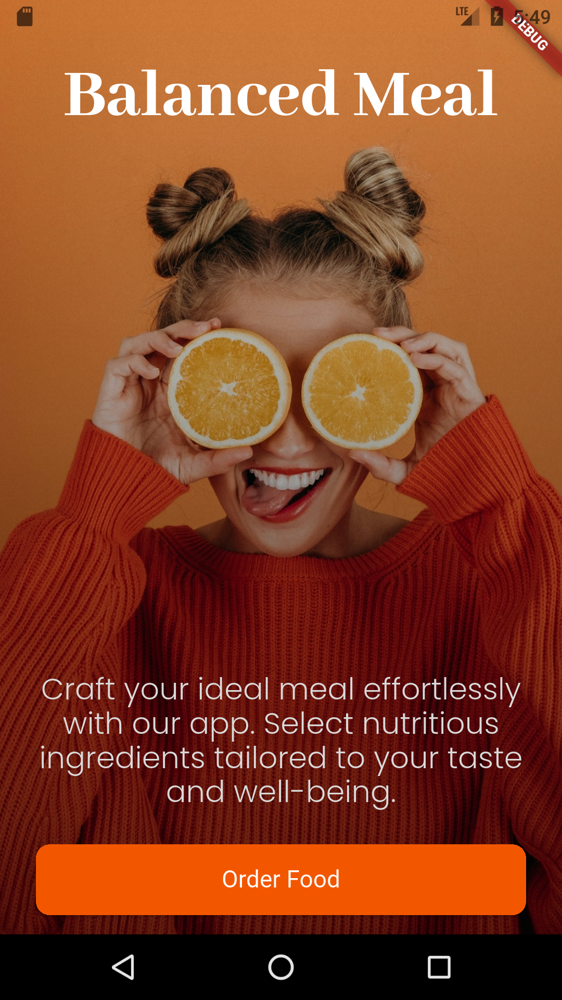
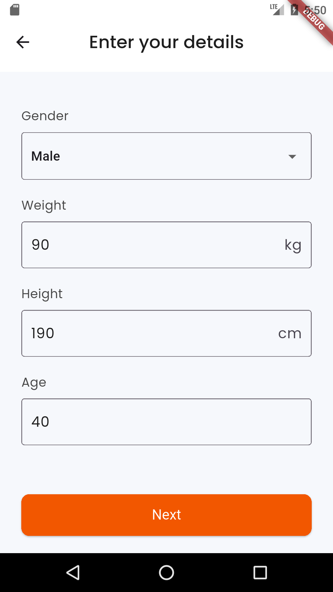
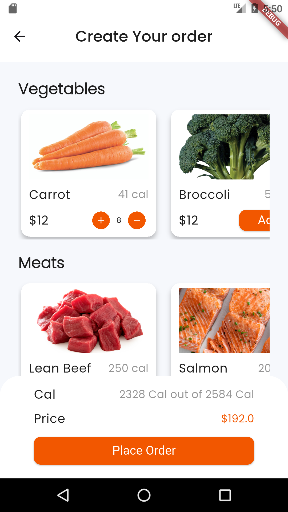
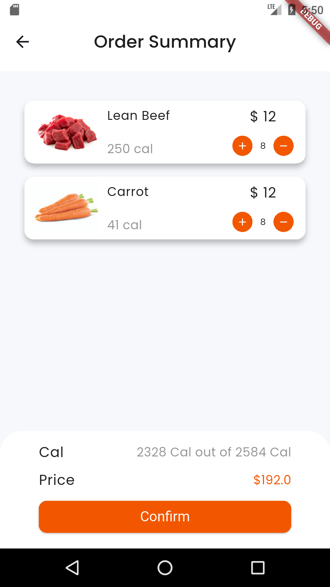

# Balanced Meal

**Balanced Meal** is a Flutter-based application designed to help users calculate their daily calorie needs and create meal plans by selecting ingredients from various categories. The app integrates Firebase Firestore for dynamic ingredient data, follows a clean architecture, and emphasizes responsive design and user-friendly interactions.

---

## Architecture

The app follows the **MVC (Model-View-Controller)** pattern:

- **Model**: Defines data entities such as `Ingredient`.
- **View**: Contains UI screens and reusable widgets organized in folders for clarity.
- **Controller**: Handles business logic, calculations, and state management using a centralized shared class for ingredient selection.

---

## Features

### User Info Input

- Collects user's gender, age, height, and weight.
- Calculates daily calorie needs using the **Harris-Benedict equation**.
- Input validation prevents invalid data such as zero, negative values, or unrealistic entries:
  - Max weight: 635 kg (based on world record).
  - Max height: 251 cm (based on world record).
  - Max age: 116 years (based on verified longest lifespan).

### Ingredient Selection

- Users browse ingredients by category (Vegetables, Meat, Carbs) fetched dynamically from **Firebase Firestore**.
- Ingredients display includes images, calorie info, and selection controls.
- Quantity adjustments dynamically update total calories and price.
- When calories reach at least 90% of the goal, users can proceed to place an order.

### Order Summary

- Shows selected ingredients with quantity controls.
- Allows users to remove ingredients by setting quantity to zero.
- Supports navigation back to add more ingredients seamlessly.
- Confirmation sends a POST request to an API endpoint, with success/failure handling.

### Responsive Design & UX

- Supports multiple screen sizes using `flutter_screenutil`.
- Custom app bar with consistent styling across screens.
- Loading indicators using Lottie animations.
- Skeleton loaders and error handling for images.
- Smooth navigation flow between screens.

---

## Folder Structure Highlights

### Views/Widgets

- `appBar.dart`: Custom app bar used across all screens except welcome.
- **Order Widgets**:
  - `OrderBottomSheet.dart`: Displays order summary, total calories, and confirm button.
  - `ingredient_cart_card.dart`: Shows ingredients in cart with quantity controls.
- **Ingredients Widgets**:
  - `ingredient_card.dart`: Individual ingredient display with image, calorie info, and controls.
  - `ingredient_list_view.dart`: Horizontal scrollable ingredient lists by category.
- **Screens**:
  - `user_info_screen.dart`: Collects user data for calorie calculation.
  - `place_order_screen.dart`: Main ingredient selection screen with loading/error handling.
  - `order_summary_screen.dart`: Shows final selected ingredients and order confirmation.

---

## Technology Stack & Packages

```yaml
# UI & Responsiveness
flutter_screenutil: ^5.9.3
google_fonts: ^4.0.3
lottie: ^2.2.0

# Firebase
firebase_core: ^3.12.1
cloud_firestore: ^5.6.6

# Networking & Security
http: ^0.13.5
flutter_dotenv: ^5.2.1
```

## Installation

1. Clone the repository:
   ```sh
   git clone https://github.com/AbdelrahmanHamdyDev/Balanced-meal.git
   ```
2. Navigate to the project directory:
   ```sh
   cd Balanced-meal
   ```
3. Install dependencies:
   ```sh
   flutter pub get
   ```
4. Create a `.env` file in the `lib` folder and add your API key:
   ```env
   API_BASE_URL = your_api_key
   ```
5. Set up Firebase:

   - Follow [Firebase Setup Guide](https://firebase.google.com/docs/flutter/setup) to add Firebase to your Flutter app.
   - Enable Firestore and Firebase Authentication.
   - Download and add the `google-services.json` file for Android and `GoogleService-Info.plist` for iOS.

6. Run the app:

   ```sh
   flutter run
   ```

   ### App Screens

| Welcome Screen                             | User_Data Screen                          | Order_Selection Screen                               | Order_confirmed Screen                             |
| ------------------------------------------ | ----------------------------------------- | ---------------------------------------------------- | -------------------------------------------------- |
|  |  |  |  |

## Contributions

Feel free to fork the repository and submit pull requests for improvements.
